<picture>
  <source media="(prefers-color-scheme: dark) and (max-width: 560px)" srcset=".github/assets/hero-dark-sm.svg">
  <source media="(prefers-color-scheme: dark)" srcset=".github/assets/hero-dark.svg">
  <source media="(max-width: 560px)" srcset=".github/assets/hero-light-sm.svg">
  
</picture>

<p align="center">
  
</p>

<p align="center"><sub>Todo lo que afirmo aquí se puede comprobar. Cada dato de esta página lo lee un workflow desde la API de GitHub.</sub></p>

---

## The section

I am not a specialist who occasionally leaves their layer. I work down the whole
stack and the same discipline travels with me: every project ships a security
posture, an accessibility baseline, an honest account of its limits, and
something you can actually run.

<picture>
  <source media="(prefers-color-scheme: dark) and (max-width: 560px)" srcset=".github/assets/section-dark-sm.svg">
  <source media="(prefers-color-scheme: dark)" srcset=".github/assets/section-dark.svg">
  <source media="(max-width: 560px)" srcset=".github/assets/section-light-sm.svg">
  
</picture>

---

## The work

<table>
<tr>
<td width="33%" valign="top">
<a href="https://github.com/ikerperez12/NexoIP-3D-Viewer"></a>
<b>NexoIP 3D Viewer</b><br>
<sub>Offline-first 3D asset viewer for Windows. The Electron renderer is sandboxed with no filesystem or Node access; models reach it through a private <code>nexoip://</code> protocol. The v1.0.0 alpha ships SHA-256 sums, a CycloneDX SBOM and third-party notices — and says plainly that the binaries are not code-signed.</sub><br>
<sub><code>Electron</code> <code>Three.js</code> <code>CodeQL</code></sub>
</td>
<td width="33%" valign="top">
<a href="https://github.com/ikerperez12/IP-OS-LINUX"></a>
<b>IP Linux</b> · <a href="https://ip-os-linux.vercel.app">live</a><br>
<sub>A desktop that runs in a tab: window manager, virtual workspaces, snap assist, and a filesystem backed by IndexedDB. Static build, no backend, no secrets, CSP and a restrictive permissions policy on the deployment.</sub><br>
<sub><code>React 19</code> <code>TypeScript</code> <code>Vite</code></sub>
</td>
<td width="33%" valign="top">
<a href="https://github.com/ikerperez12/UI-IP-Toolkit-v4.0"></a>
<b>UI IP Toolkit</b> · <a href="https://ui-ip-toolkit.vercel.app">live</a><br>
<sub>A copy-ready catalogue of interface parts. Playwright and axe-core run in CI and fail on serious or critical accessibility regressions, so the snippets people paste are checked rather than assumed. Fonts, audio and scripts are self-hosted; nothing third-party loads at runtime.</sub><br>
<sub><code>HTML</code> <code>CSS</code> <code>axe-core</code></sub>
</td>
</tr>
<tr>
<td width="33%" valign="top">
<a href="https://github.com/ikerperez12/e36"></a>
<b>E36 Scroll Cine</b> · <a href="https://e36.vercel.app">live</a><br>
<sub>Seven locked-scroll scenes built with no framework at all — plain HTML, CSS and JavaScript, a service worker, and two small Vercel Functions. Rendered accessibility tests and a public-route secret scan run on every push. Fan-made and explicitly non-official, with a legal page saying so.</sub><br>
<sub><code>Vanilla JS</code> <code>PWA</code> <code>Playwright</code></sub>
</td>
<td width="33%" valign="top">
<a href="https://github.com/ikerperez12/warpod"></a>
<b>Warpod Studio</b> · <a href="https://warpod.vercel.app">live</a><br>
<sub>Cinematic WebGL: an interactive React Three Fiber scene, GSAP ScrollTrigger choreography and Lenis smooth scroll, with video curtain transitions between sections. Strict CSP and frame protection on the deployment.</sub><br>
<sub><code>React Three Fiber</code> <code>GSAP</code> <code>WebGL</code></sub>
</td>
<td width="33%" valign="top">
<a href="https://github.com/ikerperez12/EASY-LOCALHOST"></a>
<b>Easy Localhost</b><br>
<sub>A small always-on-top panel that tells you which localhost ports are alive, which project each belongs to, and lets you close one cleanly. Reads local process and socket metadata only, never touches your source, makes no external calls. Ten releases, each with a published SHA-256; bandit and pip-audit run over the source.</sub><br>
<sub><code>Python</code> <code>psutil</code> <code>PyInstaller</code></sub>
</td>
</tr>
</table>

Two more worth opening: **[IP Blender Tool](https://github.com/ikerperez12/BLENDER-TOOL)**,
a render queue that inspects `.blend` files for missing textures before it commits
you to an overnight job, and **[QuantumGuard](https://github.com/ikerperez12/1.2-AuditoriaPQC)**,
a post-quantum crypto lab that drives real Open Quantum Safe containers when Docker
is available and falls back to a deterministic model when it is not.

---

## The core sample

The solid below is generated from the audit, not drawn. Each tier is one of my
repositories and its width is the number of engineering controls a workflow could
actually verify in it this morning; the tiers are stacked widest-first, so the
shape rests on the work that proves the most. **Drag it — GitHub renders ASCII STL
natively, so the viewer is the page itself.** The same geometry lives at
[`core.stl`](.github/assets/core.stl), which opens in NexoIP 3D Viewer.

<!-- core:start -->
```stl
solid iker-perez-core
facet normal 0 0 -1
outer loop
vertex -27.6 -27.6 -27
vertex -27.6 27.6 -27
vertex 27.6 27.6 -27
endloop
endfacet
facet normal 0 0 -1
outer loop
vertex -27.6 -27.6 -27
vertex 27.6 27.6 -27
vertex 27.6 -27.6 -27
endloop
endfacet
facet normal 0 0 1
outer loop
vertex -27.6 -27.6 -21
vertex 27.6 -27.6 -21
vertex 27.6 27.6 -21
endloop
endfacet
facet normal 0 0 1
outer loop
vertex -27.6 -27.6 -21
vertex 27.6 27.6 -21
vertex -27.6 27.6 -21
endloop
endfacet
facet normal 0 -1 0
outer loop
vertex -27.6 -27.6 -27
vertex 27.6 -27.6 -27
vertex 27.6 -27.6 -21
endloop
endfacet
facet normal 0 -1 0
outer loop
vertex -27.6 -27.6 -27
vertex 27.6 -27.6 -21
vertex -27.6 -27.6 -21
endloop
endfacet
facet normal 1 0 0
outer loop
vertex 27.6 -27.6 -27
vertex 27.6 27.6 -27
vertex 27.6 27.6 -21
endloop
endfacet
facet normal 1 0 0
outer loop
vertex 27.6 -27.6 -27
vertex 27.6 27.6 -21
vertex 27.6 -27.6 -21
endloop
endfacet
facet normal 0 1 0
outer loop
vertex 27.6 27.6 -27
vertex -27.6 27.6 -27
vertex -27.6 27.6 -21
endloop
endfacet
facet normal 0 1 0
outer loop
vertex 27.6 27.6 -27
vertex -27.6 27.6 -21
vertex 27.6 27.6 -21
endloop
endfacet
facet normal -1 0 0
outer loop
vertex -27.6 27.6 -27
vertex -27.6 -27.6 -27
vertex -27.6 -27.6 -21
endloop
endfacet
facet normal -1 0 0
outer loop
vertex -27.6 27.6 -27
vertex -27.6 -27.6 -21
vertex -27.6 27.6 -21
endloop
endfacet
facet normal 0 0 -1
outer loop
vertex -18 -18 -21
vertex -18 18 -21
vertex 18 18 -21
endloop
endfacet
facet normal 0 0 -1
outer loop
vertex -18 -18 -21
vertex 18 18 -21
vertex 18 -18 -21
endloop
endfacet
facet normal 0 0 1
outer loop
vertex -18 -18 -15
vertex 18 -18 -15
vertex 18 18 -15
endloop
endfacet
facet normal 0 0 1
outer loop
vertex -18 -18 -15
vertex 18 18 -15
vertex -18 18 -15
endloop
endfacet
facet normal 0 -1 0
outer loop
vertex -18 -18 -21
vertex 18 -18 -21
vertex 18 -18 -15
endloop
endfacet
facet normal 0 -1 0
outer loop
vertex -18 -18 -21
vertex 18 -18 -15
vertex -18 -18 -15
endloop
endfacet
facet normal 1 0 0
outer loop
vertex 18 -18 -21
vertex 18 18 -21
vertex 18 18 -15
endloop
endfacet
facet normal 1 0 0
outer loop
vertex 18 -18 -21
vertex 18 18 -15
vertex 18 -18 -15
endloop
endfacet
facet normal 0 1 0
outer loop
vertex 18 18 -21
vertex -18 18 -21
vertex -18 18 -15
endloop
endfacet
facet normal 0 1 0
outer loop
vertex 18 18 -21
vertex -18 18 -15
vertex 18 18 -15
endloop
endfacet
facet normal -1 0 0
outer loop
vertex -18 18 -21
vertex -18 -18 -21
vertex -18 -18 -15
endloop
endfacet
facet normal -1 0 0
outer loop
vertex -18 18 -21
vertex -18 -18 -15
vertex -18 18 -15
endloop
endfacet
facet normal 0 0 -1
outer loop
vertex -18 -18 -15
vertex -18 18 -15
vertex 18 18 -15
endloop
endfacet
facet normal 0 0 -1
outer loop
vertex -18 -18 -15
vertex 18 18 -15
vertex 18 -18 -15
endloop
endfacet
facet normal 0 0 1
outer loop
vertex -18 -18 -9
vertex 18 -18 -9
vertex 18 18 -9
endloop
endfacet
facet normal 0 0 1
outer loop
vertex -18 -18 -9
vertex 18 18 -9
vertex -18 18 -9
endloop
endfacet
facet normal 0 -1 0
outer loop
vertex -18 -18 -15
vertex 18 -18 -15
vertex 18 -18 -9
endloop
endfacet
facet normal 0 -1 0
outer loop
vertex -18 -18 -15
vertex 18 -18 -9
vertex -18 -18 -9
endloop
endfacet
facet normal 1 0 0
outer loop
vertex 18 -18 -15
vertex 18 18 -15
vertex 18 18 -9
endloop
endfacet
facet normal 1 0 0
outer loop
vertex 18 -18 -15
vertex 18 18 -9
vertex 18 -18 -9
endloop
endfacet
facet normal 0 1 0
outer loop
vertex 18 18 -15
vertex -18 18 -15
vertex -18 18 -9
endloop
endfacet
facet normal 0 1 0
outer loop
vertex 18 18 -15
vertex -18 18 -9
vertex 18 18 -9
endloop
endfacet
facet normal -1 0 0
outer loop
vertex -18 18 -15
vertex -18 -18 -15
vertex -18 -18 -9
endloop
endfacet
facet normal -1 0 0
outer loop
vertex -18 18 -15
vertex -18 -18 -9
vertex -18 18 -9
endloop
endfacet
facet normal 0 0 -1
outer loop
vertex -15.6 -15.6 -9
vertex -15.6 15.6 -9
vertex 15.6 15.6 -9
endloop
endfacet
facet normal 0 0 -1
outer loop
vertex -15.6 -15.6 -9
vertex 15.6 15.6 -9
vertex 15.6 -15.6 -9
endloop
endfacet
facet normal 0 0 1
outer loop
vertex -15.6 -15.6 -3
vertex 15.6 -15.6 -3
vertex 15.6 15.6 -3
endloop
endfacet
facet normal 0 0 1
outer loop
vertex -15.6 -15.6 -3
vertex 15.6 15.6 -3
vertex -15.6 15.6 -3
endloop
endfacet
facet normal 0 -1 0
outer loop
vertex -15.6 -15.6 -9
vertex 15.6 -15.6 -9
vertex 15.6 -15.6 -3
endloop
endfacet
facet normal 0 -1 0
outer loop
vertex -15.6 -15.6 -9
vertex 15.6 -15.6 -3
vertex -15.6 -15.6 -3
endloop
endfacet
facet normal 1 0 0
outer loop
vertex 15.6 -15.6 -9
vertex 15.6 15.6 -9
vertex 15.6 15.6 -3
endloop
endfacet
facet normal 1 0 0
outer loop
vertex 15.6 -15.6 -9
vertex 15.6 15.6 -3
vertex 15.6 -15.6 -3
endloop
endfacet
facet normal 0 1 0
outer loop
vertex 15.6 15.6 -9
vertex -15.6 15.6 -9
vertex -15.6 15.6 -3
endloop
endfacet
facet normal 0 1 0
outer loop
vertex 15.6 15.6 -9
vertex -15.6 15.6 -3
vertex 15.6 15.6 -3
endloop
endfacet
facet normal -1 0 0
outer loop
vertex -15.6 15.6 -9
vertex -15.6 -15.6 -9
vertex -15.6 -15.6 -3
endloop
endfacet
facet normal -1 0 0
outer loop
vertex -15.6 15.6 -9
vertex -15.6 -15.6 -3
vertex -15.6 15.6 -3
endloop
endfacet
facet normal 0 0 -1
outer loop
vertex -13.2 -13.2 -3
vertex -13.2 13.2 -3
vertex 13.2 13.2 -3
endloop
endfacet
facet normal 0 0 -1
outer loop
vertex -13.2 -13.2 -3
vertex 13.2 13.2 -3
vertex 13.2 -13.2 -3
endloop
endfacet
facet normal 0 0 1
outer loop
vertex -13.2 -13.2 3
vertex 13.2 -13.2 3
vertex 13.2 13.2 3
endloop
endfacet
facet normal 0 0 1
outer loop
vertex -13.2 -13.2 3
vertex 13.2 13.2 3
vertex -13.2 13.2 3
endloop
endfacet
facet normal 0 -1 0
outer loop
vertex -13.2 -13.2 -3
vertex 13.2 -13.2 -3
vertex 13.2 -13.2 3
endloop
endfacet
facet normal 0 -1 0
outer loop
vertex -13.2 -13.2 -3
vertex 13.2 -13.2 3
vertex -13.2 -13.2 3
endloop
endfacet
facet normal 1 0 0
outer loop
vertex 13.2 -13.2 -3
vertex 13.2 13.2 -3
vertex 13.2 13.2 3
endloop
endfacet
facet normal 1 0 0
outer loop
vertex 13.2 -13.2 -3
vertex 13.2 13.2 3
vertex 13.2 -13.2 3
endloop
endfacet
facet normal 0 1 0
outer loop
vertex 13.2 13.2 -3
vertex -13.2 13.2 -3
vertex -13.2 13.2 3
endloop
endfacet
facet normal 0 1 0
outer loop
vertex 13.2 13.2 -3
vertex -13.2 13.2 3
vertex 13.2 13.2 3
endloop
endfacet
facet normal -1 0 0
outer loop
vertex -13.2 13.2 -3
vertex -13.2 -13.2 -3
vertex -13.2 -13.2 3
endloop
endfacet
facet normal -1 0 0
outer loop
vertex -13.2 13.2 -3
vertex -13.2 -13.2 3
vertex -13.2 13.2 3
endloop
endfacet
facet normal 0 0 -1
outer loop
vertex -10.8 -10.8 3
vertex -10.8 10.8 3
vertex 10.8 10.8 3
endloop
endfacet
facet normal 0 0 -1
outer loop
vertex -10.8 -10.8 3
vertex 10.8 10.8 3
vertex 10.8 -10.8 3
endloop
endfacet
facet normal 0 0 1
outer loop
vertex -10.8 -10.8 9
vertex 10.8 -10.8 9
vertex 10.8 10.8 9
endloop
endfacet
facet normal 0 0 1
outer loop
vertex -10.8 -10.8 9
vertex 10.8 10.8 9
vertex -10.8 10.8 9
endloop
endfacet
facet normal 0 -1 0
outer loop
vertex -10.8 -10.8 3
vertex 10.8 -10.8 3
vertex 10.8 -10.8 9
endloop
endfacet
facet normal 0 -1 0
outer loop
vertex -10.8 -10.8 3
vertex 10.8 -10.8 9
vertex -10.8 -10.8 9
endloop
endfacet
facet normal 1 0 0
outer loop
vertex 10.8 -10.8 3
vertex 10.8 10.8 3
vertex 10.8 10.8 9
endloop
endfacet
facet normal 1 0 0
outer loop
vertex 10.8 -10.8 3
vertex 10.8 10.8 9
vertex 10.8 -10.8 9
endloop
endfacet
facet normal 0 1 0
outer loop
vertex 10.8 10.8 3
vertex -10.8 10.8 3
vertex -10.8 10.8 9
endloop
endfacet
facet normal 0 1 0
outer loop
vertex 10.8 10.8 3
vertex -10.8 10.8 9
vertex 10.8 10.8 9
endloop
endfacet
facet normal -1 0 0
outer loop
vertex -10.8 10.8 3
vertex -10.8 -10.8 3
vertex -10.8 -10.8 9
endloop
endfacet
facet normal -1 0 0
outer loop
vertex -10.8 10.8 3
vertex -10.8 -10.8 9
vertex -10.8 10.8 9
endloop
endfacet
facet normal 0 0 -1
outer loop
vertex -8.4 -8.4 9
vertex -8.4 8.4 9
vertex 8.4 8.4 9
endloop
endfacet
facet normal 0 0 -1
outer loop
vertex -8.4 -8.4 9
vertex 8.4 8.4 9
vertex 8.4 -8.4 9
endloop
endfacet
facet normal 0 0 1
outer loop
vertex -8.4 -8.4 15
vertex 8.4 -8.4 15
vertex 8.4 8.4 15
endloop
endfacet
facet normal 0 0 1
outer loop
vertex -8.4 -8.4 15
vertex 8.4 8.4 15
vertex -8.4 8.4 15
endloop
endfacet
facet normal 0 -1 0
outer loop
vertex -8.4 -8.4 9
vertex 8.4 -8.4 9
vertex 8.4 -8.4 15
endloop
endfacet
facet normal 0 -1 0
outer loop
vertex -8.4 -8.4 9
vertex 8.4 -8.4 15
vertex -8.4 -8.4 15
endloop
endfacet
facet normal 1 0 0
outer loop
vertex 8.4 -8.4 9
vertex 8.4 8.4 9
vertex 8.4 8.4 15
endloop
endfacet
facet normal 1 0 0
outer loop
vertex 8.4 -8.4 9
vertex 8.4 8.4 15
vertex 8.4 -8.4 15
endloop
endfacet
facet normal 0 1 0
outer loop
vertex 8.4 8.4 9
vertex -8.4 8.4 9
vertex -8.4 8.4 15
endloop
endfacet
facet normal 0 1 0
outer loop
vertex 8.4 8.4 9
vertex -8.4 8.4 15
vertex 8.4 8.4 15
endloop
endfacet
facet normal -1 0 0
outer loop
vertex -8.4 8.4 9
vertex -8.4 -8.4 9
vertex -8.4 -8.4 15
endloop
endfacet
facet normal -1 0 0
outer loop
vertex -8.4 8.4 9
vertex -8.4 -8.4 15
vertex -8.4 8.4 15
endloop
endfacet
facet normal 0 0 -1
outer loop
vertex -8.4 -8.4 15
vertex -8.4 8.4 15
vertex 8.4 8.4 15
endloop
endfacet
facet normal 0 0 -1
outer loop
vertex -8.4 -8.4 15
vertex 8.4 8.4 15
vertex 8.4 -8.4 15
endloop
endfacet
facet normal 0 0 1
outer loop
vertex -8.4 -8.4 21
vertex 8.4 -8.4 21
vertex 8.4 8.4 21
endloop
endfacet
facet normal 0 0 1
outer loop
vertex -8.4 -8.4 21
vertex 8.4 8.4 21
vertex -8.4 8.4 21
endloop
endfacet
facet normal 0 -1 0
outer loop
vertex -8.4 -8.4 15
vertex 8.4 -8.4 15
vertex 8.4 -8.4 21
endloop
endfacet
facet normal 0 -1 0
outer loop
vertex -8.4 -8.4 15
vertex 8.4 -8.4 21
vertex -8.4 -8.4 21
endloop
endfacet
facet normal 1 0 0
outer loop
vertex 8.4 -8.4 15
vertex 8.4 8.4 15
vertex 8.4 8.4 21
endloop
endfacet
facet normal 1 0 0
outer loop
vertex 8.4 -8.4 15
vertex 8.4 8.4 21
vertex 8.4 -8.4 21
endloop
endfacet
facet normal 0 1 0
outer loop
vertex 8.4 8.4 15
vertex -8.4 8.4 15
vertex -8.4 8.4 21
endloop
endfacet
facet normal 0 1 0
outer loop
vertex 8.4 8.4 15
vertex -8.4 8.4 21
vertex 8.4 8.4 21
endloop
endfacet
facet normal -1 0 0
outer loop
vertex -8.4 8.4 15
vertex -8.4 -8.4 15
vertex -8.4 -8.4 21
endloop
endfacet
facet normal -1 0 0
outer loop
vertex -8.4 8.4 15
vertex -8.4 -8.4 21
vertex -8.4 8.4 21
endloop
endfacet
facet normal 0 0 -1
outer loop
vertex -6 -6 21
vertex -6 6 21
vertex 6 6 21
endloop
endfacet
facet normal 0 0 -1
outer loop
vertex -6 -6 21
vertex 6 6 21
vertex 6 -6 21
endloop
endfacet
facet normal 0 0 1
outer loop
vertex -6 -6 27
vertex 6 -6 27
vertex 6 6 27
endloop
endfacet
facet normal 0 0 1
outer loop
vertex -6 -6 27
vertex 6 6 27
vertex -6 6 27
endloop
endfacet
facet normal 0 -1 0
outer loop
vertex -6 -6 21
vertex 6 -6 21
vertex 6 -6 27
endloop
endfacet
facet normal 0 -1 0
outer loop
vertex -6 -6 21
vertex 6 -6 27
vertex -6 -6 27
endloop
endfacet
facet normal 1 0 0
outer loop
vertex 6 -6 21
vertex 6 6 21
vertex 6 6 27
endloop
endfacet
facet normal 1 0 0
outer loop
vertex 6 -6 21
vertex 6 6 27
vertex 6 -6 27
endloop
endfacet
facet normal 0 1 0
outer loop
vertex 6 6 21
vertex -6 6 21
vertex -6 6 27
endloop
endfacet
facet normal 0 1 0
outer loop
vertex 6 6 21
vertex -6 6 27
vertex 6 6 27
endloop
endfacet
facet normal -1 0 0
outer loop
vertex -6 6 21
vertex -6 -6 21
vertex -6 -6 27
endloop
endfacet
facet normal -1 0 0
outer loop
vertex -6 6 21
vertex -6 -6 27
vertex -6 6 27
endloop
endfacet
endsolid iker-perez-core
```
<!-- core:end -->

<details>
<summary>What each tier is</summary>

<!-- corelegend:start -->
| Tier | Layer | Repository | Controls verified |
| :-: | --- | --- | :-: |
| 1 | desktop 3D | [NexoIP 3D Viewer](https://github.com/ikerperez12/NexoIP-3D-Viewer) | 9 |
| 2 | dev tooling | [Easy Localhost](https://github.com/ikerperez12/EASY-LOCALHOST) | 5 |
| 3 | web experience | [E36 Scroll Cine](https://github.com/ikerperez12/e36) | 5 |
| 4 | web platform | [IP Linux](https://github.com/ikerperez12/IP-OS-LINUX) | 4 |
| 5 | interface | [UI IP Toolkit](https://github.com/ikerperez12/UI-IP-Toolkit-v4.0) | 3 |
| 6 | pipeline | [IP Blender Tool](https://github.com/ikerperez12/BLENDER-TOOL) | 2 |
| 7 | security | [QuantumGuard PQC lab](https://github.com/ikerperez12/1.2-AuditoriaPQC) | 1 |
| 8 | real-time 3D | [Warpod Studio](https://github.com/ikerperez12/warpod) | 1 |
| 9 | systems | [SO-2324](https://github.com/ikerperez12/SO-2324) | 0 |
<!-- corelegend:end -->

A repository that proves nothing produces a sliver. That is the point: this is a
shape only these repositories can make, and it changes when they do.

</details>

---

## The audit

A workflow reads every project each morning and records what it can confirm —
not what I would like to claim. Gaps are left visible on purpose.

<!-- audit:start -->
| Project | CI | CQL | SEC | LIC | CTB | ARC | A11Y | DEP | SHA | SBOM | Verified |
| --- | :-: | :-: | :-: | :-: | :-: | :-: | :-: | :-: | :-: | :-: | :-: |
| [NexoIP 3D Viewer](https://github.com/ikerperez12/NexoIP-3D-Viewer) | ● | ● | ● | ● | ● | ● | ● | · | ● | ● | 9/10 |
| [IP Linux](https://github.com/ikerperez12/IP-OS-LINUX) | ● | · | ● | ● | · | · | · | ● | · | · | 4/10 |
| [UI IP Toolkit](https://github.com/ikerperez12/UI-IP-Toolkit-v4.0) | ● | · | · | ● | · | · | ● | · | · | · | 3/10 |
| [E36 Scroll Cine](https://github.com/ikerperez12/e36) | ● | · | ● | ● | · | · | ● | ● | · | · | 5/10 |
| [Warpod Studio](https://github.com/ikerperez12/warpod) | · | · | · | ● | · | · | · | · | · | · | 1/10 |
| [IP Blender Tool](https://github.com/ikerperez12/BLENDER-TOOL) | · | · | · | ● | · | · | · | · | ● | · | 2/10 |
| [Easy Localhost](https://github.com/ikerperez12/EASY-LOCALHOST) | ● | · | ● | ● | · | · | · | ● | ● | · | 5/10 |
| [QuantumGuard PQC lab](https://github.com/ikerperez12/1.2-AuditoriaPQC) | · | · | · | ● | · | · | · | · | · | · | 1/10 |
<!-- audit:end -->

<details>
<summary>What each column means</summary>

<!-- auditlegend:start -->
- `CI` — a CI workflow exists
- `CQL` — CodeQL analysis runs
- `SEC` — SECURITY.md is published
- `LIC` — the repository is licensed
- `CTB` — CONTRIBUTING.md is published
- `ARC` — an architecture document exists
- `A11Y` — accessibility tests run in CI
- `DEP` — dependencies are audited in CI
- `SHA` — releases publish SHA-256 sums
- `SBOM` — releases publish a software bill of materials
<!-- auditlegend:end -->

A dot is not a criticism. A static catalogue does not need a software bill of
materials, and a research lab does not need a signed release. The table records
what is present, so the shape of each row says what kind of project it is.

</details>

<details>
<summary>Deployments, last checked this morning</summary>

<!-- probes:start -->
- `answered 200` — [ip-os-linux.vercel.app](https://ip-os-linux.vercel.app)
- `answered 200` — [ui-ip-toolkit.vercel.app](https://ui-ip-toolkit.vercel.app/)
- `answered 200` — [e36.vercel.app](https://e36.vercel.app)
- `answered 200` — [warpod.vercel.app](https://warpod.vercel.app)
<!-- probes:end -->

Reported as reachability only. A deployment that does not answer is recorded as
such rather than quietly dropped.

</details>

---

## Colophon

This page is the output of a small program. [`scripts/collect.mjs`](scripts/collect.mjs)
queries the GitHub API, [`scripts/build.mjs`](scripts/build.mjs) renders the SVGs
and the STL from the result, and
[`.github/workflows/audit.yml`](.github/workflows/audit.yml) commits whatever
changed. The generated regions are bounded by HTML comments; everything else here
was written by hand.

No third-party image services are used, so nothing on this page can break when
someone else's endpoint goes down, and no request leaves GitHub when you read it.
Motion is CSS inside the SVGs and is disabled for `prefers-reduced-motion`.

The keyboard is a derivative of *NZXT miniTKL — mechanical Keyboard* by
[BlackCube](https://sketchfab.com/blackcube4), used under
[CC BY 4.0](https://creativecommons.org/licenses/by/4.0/) and modified; the
original author and NZXT do not endorse it.

<!-- stamp:start -->
Last audit: **2026-08-14 17:18 UTC**. Everything above is read from the GitHub API by [`scripts/collect.mjs`](scripts/collect.mjs) — nothing is typed in by hand.
<!-- stamp:end -->

<sub>A Coruña, Galicia · [ikerperez12](https://github.com/ikerperez12)</sub>
