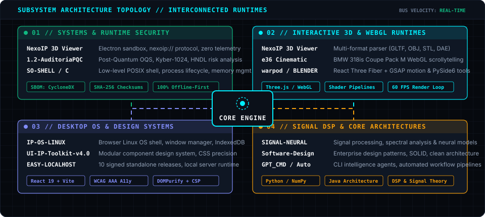

<!--
  =============================================================================
  IKER PEREZ // FULL-TECH COMPUTER ENGINEER & SYSTEMS TECHNOLOGIST
  Profile README Architecture: Living Telemetry HUD & Subsystem Matrix
  Engineered with Zero External Widget Dependencies & Pure SVG Animations
  =============================================================================
-->

<p align="center">
  <picture>
    <source media="(prefers-color-scheme: dark)" srcset="assets/hero-dark.svg">
    <source media="(prefers-color-scheme: light)" srcset="assets/hero-light.svg">
    
  </picture>
</p>

<p align="center">
  <a href="https://github.com/ikerperez12?tab=repositories&q=&type=public"></a>
  <a href="https://github.com/ikerperez12/NexoIP-3D-Viewer/releases"></a>
  <a href="https://ip-os-linux.vercel.app"></a>
  <a href="https://e36.vercel.app"></a>
</p>

---

## ⚡ Engineering Philosophy & Security Baseline

I design, architect, and build software across the full computational stack — from low-level systems programming and post-quantum cryptography to interactive 3D engines and desktop-grade web operating environments.

Every product I ship adheres to strict engineering principles:

```text
  [ 01. ZERO-TELEMETRY ]        100% private, local-first by design. No tracking pixels or surveillance SDKs.
  [ 02. CRYPTOGRAPHIC PROOF ]   All standalone releases ship with CycloneDX SBOMs & SHA-256 digest validation.
  [ 03. DEFENSIVE RUNTIMES ]    Process sandboxing, custom IPC protocols (nexoip://), and strict CSP sanitization.
  [ 04. ACCESSIBILITY RIGOR ]   Automated CI gates with axe-core, WCAG AAA color ratios, and reduced-motion support.
```

---

## 🌐 Living Subsystem Topology & Architecture Matrix

*The architecture graph below represents the interconnected core domains of my technical output. It is generated natively from repository telemetry.*

<p align="center">
  <picture>
    <source media="(prefers-color-scheme: dark)" srcset="assets/subsystem-matrix-dark.svg">
    <source media="(prefers-color-scheme: light)" srcset="assets/subsystem-matrix-light.svg">
    
  </picture>
</p>

---

## 🚀 Flagship Product Showcase (Show > Claim)

<table>
  <tr>
    <td width="50%" valign="top">
      <a href="https://github.com/ikerperez12/NexoIP-3D-Viewer">
        
      </a>
      <h3><a href="https://github.com/ikerperez12/NexoIP-3D-Viewer">NexoIP 3D Viewer</a> <code>v1.0.0</code></h3>
      <p><b>Private, offline-first 3D model viewer for Windows</b> engineered with Electron, Three.js, and React. Built for inspecting complex 3D assets with zero network exposure.</p>
      <ul>
        <li><b>Security:</b> Strict sandboxing, isolated <code>nexoip://</code> custom protocol, no external telemetry.</li>
        <li><b>Supply Chain:</b> Automated CycloneDX v1.5 SBOM + SHA-256 checksums on all release binaries.</li>
        <li><b>Format Support:</b> Multi-format geometry pipeline (GLTF, OBJ, STL, DAE).</li>
      </ul>
      <p>
        <a href="https://github.com/ikerperez12/NexoIP-3D-Viewer"></a>
        <a href="https://github.com/ikerperez12/NexoIP-3D-Viewer/releases"></a>
      </p>
    </td>
    <td width="50%" valign="top">
      <a href="https://github.com/ikerperez12/IP-OS-LINUX">
        
      </a>
      <h3><a href="https://github.com/ikerperez12/IP-OS-LINUX">IP-OS-LINUX</a> <code>10 ★</code></h3>
      <p><b>Public browser-based desktop operating system</b> built with React 19, TypeScript, and Vite. Delivers a window manager, dock, virtual workspaces, and local-first apps.</p>
      <ul>
        <li><b>Architecture:</b> Local-first virtual filesystem powered by IndexedDB &amp; custom window manager.</li>
        <li><b>Security Hardened:</b> DOMPurify sanitization, strict CSP headers, zero server-side telemetry.</li>
        <li><b>Quality:</b> Responsive 4K/mobile layout, keyboard shortcuts, and WCAG AAA compliance.</li>
      </ul>
      <p>
        <a href="https://ip-os-linux.vercel.app"></a>
        <a href="https://github.com/ikerperez12/IP-OS-LINUX"></a>
      </p>
    </td>
  </tr>
  <tr>
    <td width="50%" valign="top">
      <a href="https://github.com/ikerperez12/e36">
        
      </a>
      <h3><a href="https://github.com/ikerperez12/e36">e36 — Cinematic Web Experience</a> <code>4 ★</code></h3>
      <p><b>Cinematic WebGL interactive experience</b> commemorating the BMW 318is Coupe Pack M (Hellrot 314). Features locked scrollytelling and instant poster rendering.</p>
      <ul>
        <li><b>Graphics Pipeline:</b> High-performance WebGL / Three.js 60 FPS viewport transitions.</li>
        <li><b>Engineering:</b> Zero-framework vanilla JS, service worker cache management, automated Playwright QA.</li>
        <li><b>Mobile First:</b> 9:16 vertical viewport optimization with multi-touch gesture engine.</li>
      </ul>
      <p>
        <a href="https://e36.vercel.app"></a>
        <a href="https://github.com/ikerperez12/e36"></a>
      </p>
    </td>
    <td width="50%" valign="top">
      <a href="https://github.com/ikerperez12/1.2-AuditoriaPQC">
        
      </a>
      <h3><a href="https://github.com/ikerperez12/1.2-AuditoriaPQC">1.2-AuditoriaPQC — QuantumGuard</a> <code>3 ★</code></h3>
      <p><b>Post-Quantum Cryptography (PQC) security lab</b> and evaluation framework. Audits hybrid post-quantum TLS schemes against Harvest Now, Decrypt Later (HNDL) threats.</p>
      <ul>
        <li><b>Protocols:</b> Open Quantum Safe (OQS) container integration with Kyber-1024 &amp; Dilithium-5.</li>
        <li><b>Network Telemetry:</b> Real-time packet inspection (Scapy), Key-Share MTU impact analysis.</li>
        <li><b>Side-Channel:</b> 60 FPS hardware oscilloscope simulation for cryptographic side-channel analysis.</li>
      </ul>
      <p>
        <a href="https://github.com/ikerperez12/1.2-AuditoriaPQC"></a>
        <a href="https://github.com/ikerperez12/1.2-AuditoriaPQC"></a>
      </p>
    </td>
  </tr>
  <tr>
    <td width="50%" valign="top">
      <a href="https://github.com/ikerperez12/UI-IP-Toolkit-v4.0">
        
      </a>
      <h3><a href="https://github.com/ikerperez12/UI-IP-Toolkit-v4.0">UI-IP-Toolkit-v4.0</a> <code>7 ★</code></h3>
      <p><b>Modular design system and component architecture</b> built for high-performance web applications. Zero runtime bloat with strict typographic and color tokens.</p>
      <ul>
        <li><b>Tokens:</b> 140+ CSS custom properties calibrated for deep-void themes (#090d14).</li>
        <li><b>Accessibility:</b> Strict WCAG AAA color ratios and keyboard navigation primitives.</li>
        <li><b>Modular:</b> Standalone UI modules for data tables, dialogs, drawers, and form controls.</li>
      </ul>
      <p>
        <a href="https://github.com/ikerperez12/UI-IP-Toolkit-v4.0"></a>
      </p>
    </td>
    <td width="50%" valign="top">
      <a href="https://github.com/ikerperez12/EASY-LOCALHOST">
        
      </a>
      <h3><a href="https://github.com/ikerperez12/EASY-LOCALHOST">EASY-LOCALHOST</a> <code>10 Releases</code></h3>
      <p><b>Standalone local server runtime and developer utility</b> with GUI controls. Designed for instantaneous offline asset serving with SHA-256 release validation.</p>
      <ul>
        <li><b>Releases:</b> 10 versioned standalone releases with automated build pipelines.</li>
        <li><b>Security:</b> Cryptographic SHA-256 checksums published alongside every release binary.</li>
        <li><b>Simplicity:</b> Zero setup required, automated port resolution, and live directory watching.</li>
      </ul>
      <p>
        <a href="https://github.com/ikerperez12/EASY-LOCALHOST/releases"></a>
      </p>
    </td>
  </tr>
</table>

---

## 🛠️ Engineered Capability Matrix

```text
┌──────────────────────────────────────────────────────────────────────────────────────────────────────────┐
│ ARCHITECTURAL DOMAIN           ENGINEERED CAPABILITIES & VERIFIED RUNTIMES                               │
├──────────────────────────────────────────────────────────────────────────────────────────────────────────┤
│ 🛡️ Systems & Security        │ C (POSIX/UNIX), Python, Post-Quantum Cryptography (OQS, Kyber-1024),      │
│                                │ Electron Hardening, CycloneDX SBOM, SHA-256 Verification, Custom IPC    │
│                                │                                                                         │
│ 💎 3D & Graphics Runtimes      │ Three.js, WebGL 2.0, GLSL Shaders, React Three Fiber (R3F), GSAP,       │
│                                │ PySide6 / Blender Automation, GLTF / OBJ / STL / DAE Pipeline Parsing   │
│                                │                                                                         │
│ 🖥️ Web OS & UI Systems         │ TypeScript, React 19, Vite, Next.js, IndexedDB Local-First Virtual FS, │
│                                │ DOMPurify Sanitization, WCAG AAA Accessibility, Vercel Edge CDN         │
│                                │                                                                         │
│ ⚡ Core Architectures & AI     │ Signal Processing & Neural Networks, Java Enterprise Architecture,      │
│                                │ Automated GitHub Actions CI/CD, Playwright E2E, axe-core Testing        │
└──────────────────────────────────────────────────────────────────────────────────────────────────────────┘
```

---

## 🔄 Self-Updating Telemetry Pipeline

This Profile README operates as a **living document**. It does not rely on third-party stat hosting services that can suffer outages or inject unverified cookies.

- **Automation:** Native GitHub Actions workflow ([`.github/workflows/profile-telemetry.yml`](.github/workflows/profile-telemetry.yml)) runs every 24 hours.
- **Engine:** [`scripts/generate-telemetry.mjs`](scripts/generate-telemetry.mjs) executes via Node.js, queries the GitHub GraphQL API using least-privilege tokens, and renders the dynamic vector SVGs directly into the repository.
- **Integrity:** Zero Camo proxy delays; all visual assets are served directly from the canonical repository tree.

---

<p align="center">
  <sub>Engineered with precision by <b>Iker Perez (@ikerperez12)</b> • A Coruña, Galicia, Spain</sub><br>
  <sub><i>Status: Hardened &amp; Verifiable • Architecture: Living Subsystem Topology</i></sub>
</p>
