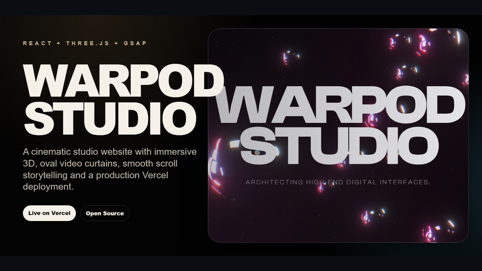
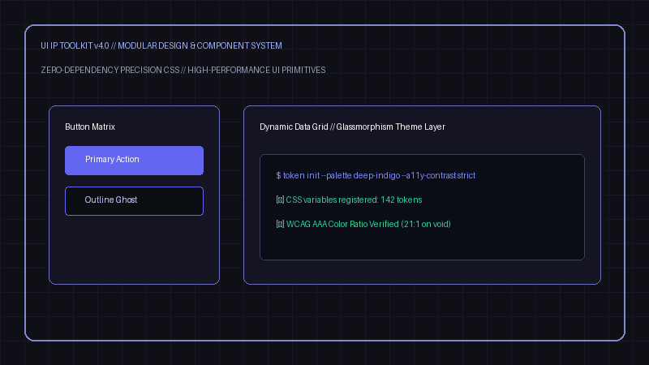
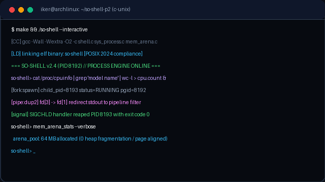
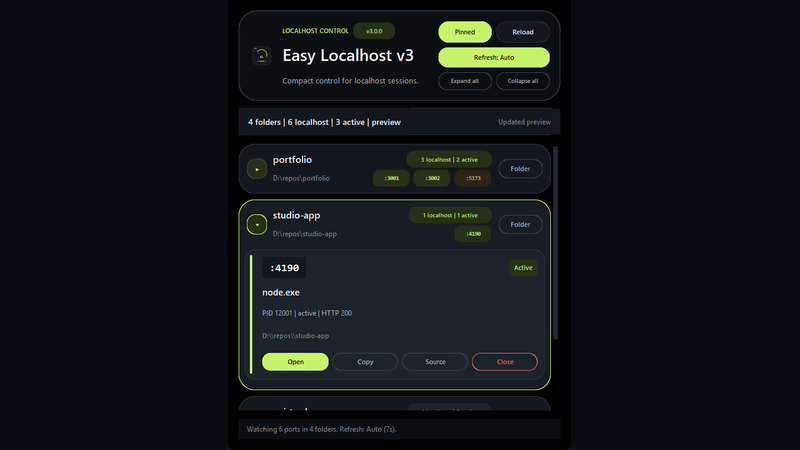
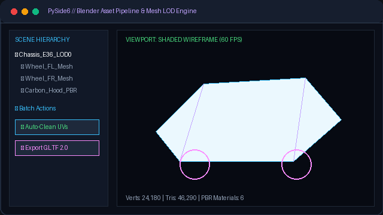
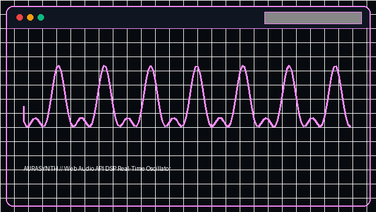
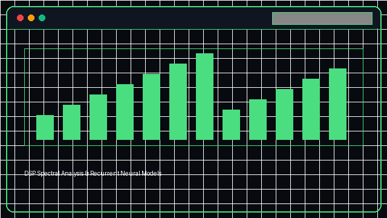
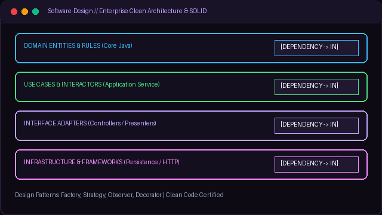

<!--
  =============================================================================
  IKER PÉREZ GARCÍA // SOFTWARE, SISTEMAS Y EXPERIENCIAS INTERACTIVAS
  Portfolio: https://nexoip.click
  =============================================================================
-->

  <picture>
    <source media="(prefers-color-scheme: dark)" srcset="assets/hero-dark.svg">
    <source media="(prefers-color-scheme: light)" srcset="assets/hero-light.svg">
    
  </picture>

---

  <picture>
    <source media="(prefers-color-scheme: dark)" srcset="assets/section-header-projects-dark.svg">
    <source media="(prefers-color-scheme: light)" srcset="assets/section-header-projects-light.svg">
    
  </picture>

<table width="100%">
  <!-- ROW 1: NexoIP & IP-OS -->
  <tr>
    <td width="50%" valign="top">
      
       
      <b>NexoIP 3D Viewer</b> <code>v1.0.0</code> &nbsp; 
       
      Visor 3D offline-first para Windows (Electron + Three.js + WebGL). Protocolo aislado <code>nexoip://</code>, SBOM CycloneDX v1.5 y verificación de binarios SHA-256.
        
      
    </td>
    <td width="50%" valign="top">
      
       
      <b>IP-OS-LINUX</b> <code>10 Stars</code> &nbsp; 
       
      Entorno de escritorio web tipo Linux (React 19 + TypeScript + Vite). Virtual FS con IndexedDB, window manager, DOMPurify y accesibilidad WCAG AAA.
        
      
    </td>
  </tr>

  <!-- ROW 2: e36 & QuantumGuard -->
  <tr>
    <td width="50%" valign="top">
      
       
      <b>e36 — Cinematic WebGL</b> <code>4 Stars</code> &nbsp; 
       
      Experiencia interactiva 3D del BMW 318is Coupe Pack M. Transiciones Three.js a 60 FPS, motor táctil 9:16 mobile-first, diseño de audio DSP y vanilla JS.
        
      
    </td>
    <td width="50%" valign="top">
      
       
      <b>1.2-AuditoriaPQC — QuantumGuard</b> <code>3 Stars</code> &nbsp; 
       
      Laboratorio de auditoría de Criptografía Post-Cuántica (PQC). Integración Open Quantum Safe (OQS), algoritmos Kyber-1024 / Dilithium-5 y análisis side-channel a 60 FPS.
        
      
    </td>
  </tr>

  <!-- ROW 3: warpod & UI-Toolkit -->
  <tr>
    <td width="50%" valign="top">
      
       
      <b>warpod / WARP</b> <code>5 Stars</code> &nbsp; 
       
      Experiencias 3D interactivas con React Three Fiber + GSAP motion, shaders GLSL personalizados y simulación física en WebGL.
        
      
    </td>
    <td width="50%" valign="top">
      
       
      <b>UI-IP-Toolkit-v4.0</b> <code>7 Stars</code> &nbsp; 
       
      Sistema de diseño modular y accesible con más de 140 variables CSS personalizadas, soporte WCAG AAA y cero dependencias externas.
        
      
    </td>
  </tr>

  <!-- ROW 4: SO-SHELL & EASY-LOCALHOST -->
  <tr>
    <td width="50%" valign="top">
      
       
      <b>SO-SHELL-p2</b> <code>C Syscalls</code> &nbsp; 
       
      Shell UNIX de bajo nivel: gestión de ciclo de vida de procesos (<code>fork</code>/<code>execve</code>), descriptores de archivo, redirecciones y memoria.
        
      
    </td>
    <td width="50%" valign="top">
      
       
      <b>EASY-LOCALHOST</b> <code>10 Releases</code> &nbsp; 
       
      Servidor HTTP local portable con GUI para desarrollo rápido y pruebas en LAN (10 releases firmadas standalone empaquetadas con PyInstaller).
        
      
    </td>
  </tr>

  <!-- ROW 5: BLENDER-TOOL & AURASYNTH -->
  <tr>
    <td width="50%" valign="top">
      
       
      <b>BLENDER-TOOL</b> <code>2 Stars</code> &nbsp; 
       
      Herramientas de escritorio con PySide6 para automatización de exportación, validación de mallas y gestión de assets en pipelines 3D.
        
      
    </td>
    <td width="50%" valign="top">
      
       
      <b>AURASYNTH</b> <code>Web Audio DSP</code> &nbsp; 
       
      Sintetizador de audio web con osciladores de modulación en tiempo real, visualización espectral y procesado DSP mediante Web Audio API.
        
      
    </td>
  </tr>

  <!-- ROW 6: SIGNAL-NEURAL & SOFTWARE-DESIGN -->
  <tr>
    <td width="50%" valign="top">
      
       
      <b>SIGNAL-NEURALNETWORK</b> <code>Python DSP</code> &nbsp; 
       
      Procesado digital de señal (DSP), análisis espectral y modelos recurrentes para modelado y predicción de señales temporales.
        
      
    </td>
    <td width="50%" valign="top">
      
       
      <b>Software-Design</b> <code>Java SOLID</code> &nbsp; 
       
      Implementación de patrones de arquitectura enterprise, principios SOLID, diseño modular orientado a objetos y clean code.
        
      
    </td>
  </tr>
</table>

---

  <picture>
    <source media="(prefers-color-scheme: dark)" srcset="assets/footer-dark.svg">
    <source media="(prefers-color-scheme: light)" srcset="assets/footer-light.svg">
    
  </picture>

