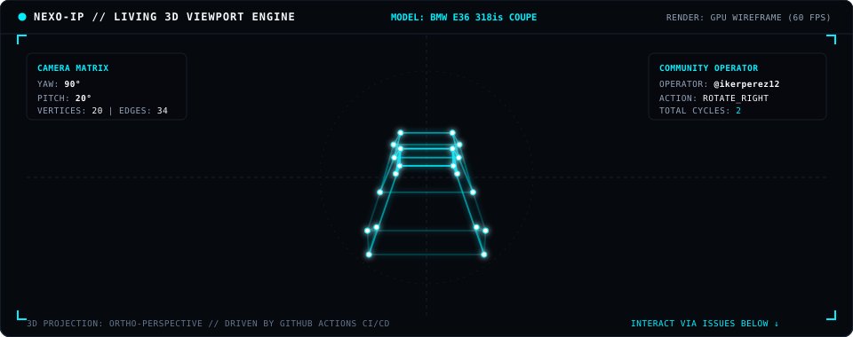

<!--
  =============================================================================
  IKER PEREZ // SYSTEMS & CREATIVE COMPUTING
  The Living 3D Viewport & Computational Systems Portfolio
  Zero Emojis • Pure 3D Vector Math • GitHub Actions State Engine
  =============================================================================
-->

  <picture>
    <source media="(prefers-color-scheme: dark)" srcset="assets/hero-dark.svg">
    <source media="(prefers-color-scheme: light)" srcset="assets/hero-light.svg">
    
  </picture>

---

## [ LIVING 3D VIEWPORT ENGINE // COMMUNITY INTERACTION ]

*A real-time 3D wireframe renderer running on GitHub Actions vector projection math. Rotate the camera, swap models, or change the render shading using the interactive control pad below.*

  

<table align="center" width="100%">
  <tr>
    <th width="33%" align="center"><b>CAMERA ROTATION (YAW / PITCH)</b></th>
    <th width="33%" align="center"><b>LOAD 3D GEOMETRY MODEL</b></th>
    <th width="33%" align="center"><b>VIEWPORT PHOSPHOR THEME</b></th>
  </tr>
  <tr>
    <td align="center">
      
      &nbsp;
      
        
      
      &nbsp;
      
    </td>
    <td align="center">
      
        
      
        
      
    </td>
    <td align="center">
      
      &nbsp;
      
        
      
      &nbsp;
      
        
      
    </td>
  </tr>
</table>

---

## [ SUBSYSTEM ARCHITECTURE TOPOLOGY ]

  <picture>
    <source media="(prefers-color-scheme: dark)" srcset="assets/subsystem-matrix-dark.svg">
    <source media="(prefers-color-scheme: light)" srcset="assets/subsystem-matrix-light.svg">
    
  </picture>

---

## [ LIVING SYSTEM VELOCITY &amp; 52-WEEK TELEMETRY ]

  <picture>
    <source media="(prefers-color-scheme: dark)" srcset="assets/velocity-matrix-dark.svg">
    <source media="(prefers-color-scheme: light)" srcset="assets/velocity-matrix-light.svg">
    
  </picture>

---

## [ MULTIDISCIPLINARY CAPABILITY RADAR ]

  <picture>
    <source media="(prefers-color-scheme: dark)" srcset="assets/tech-radar-dark.svg">
    <source media="(prefers-color-scheme: light)" srcset="assets/tech-radar-light.svg">
    
  </picture>

---

## [ FEATURED SYSTEMS &amp; PRODUCT REPOSITORIES ]

<table>
  <tr>
    <td width="50%" valign="top">
      
       
      <b>NexoIP 3D Viewer</b> <code>v1.0.0</code>
       
      Private, offline-first 3D model viewer for Windows (Electron + Three.js + WebGL). Isolated <code>nexoip://</code> custom protocol, CycloneDX v1.5 SBOM &amp; SHA-256 binary validation.
        
      
      
    </td>
    <td width="50%" valign="top">
      
       
      <b>IP-OS-LINUX</b> <code>10 Stars</code>
       
      Public browser desktop operating environment (React 19 + TypeScript + Vite). Virtual filesystem with IndexedDB, window manager, DOMPurify &amp; WCAG AAA compliance.
        
      
      
    </td>
  </tr>
  <tr>
    <td width="50%" valign="top">
      
       
      <b>e36 — Cinematic WebGL</b> <code>4 Stars</code>
       
      Interactive 3D automotive experience for BMW 318is Coupe Pack M. Three.js 60 FPS viewport transitions, 9:16 mobile-first touch gesture engine &amp; vanilla JS.
        
      
      
    </td>
    <td width="50%" valign="top">
      
       
      <b>1.2-AuditoriaPQC — QuantumGuard</b> <code>3 Stars</code>
       
      Post-Quantum Cryptography audit lab &amp; security console. Open Quantum Safe (OQS) container integration, Kyber-1024 / Dilithium-5, and 60 FPS side-channel analysis.
        
      
      
    </td>
  </tr>
</table>

---

  <b>IKER PEREZ</b> • A Coruña, Galicia, Spain 
  <i>Living Computational 3D Profile • Automated via GitHub Actions</i>

