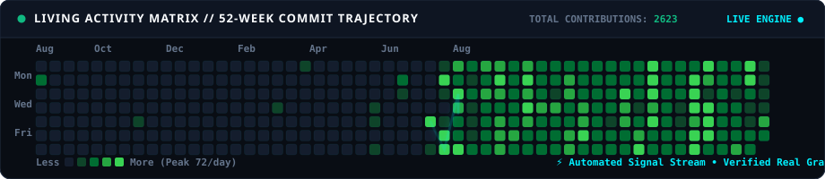
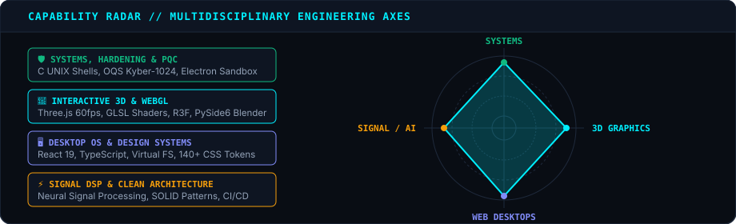

<!--
  =============================================================================
  IKER PEREZ // SYSTEMS & CREATIVE COMPUTING
  Bespoke Living GitHub Profile README — Interactive Engine & Contribution Art
  =============================================================================
-->

<p align="center">
  <picture>
    <source media="(prefers-color-scheme: dark)" srcset="assets/hero-dark.svg">
    <source media="(prefers-color-scheme: light)" srcset="assets/hero-light.svg">
    
  </picture>
</p>

---

## 🟢 Living Contribution Velocity & Activity Stream

*The calendar below is generated directly from real GitHub GraphQL telemetry. An animated data beam traverses the active commit trajectory across 52 weeks.*

<p align="center">
  <picture>
    <source media="(prefers-color-scheme: dark)" srcset="assets/contribution-snake-dark.svg">
    <source media="(prefers-color-scheme: light)" srcset="assets/contribution-snake-light.svg">
    
  </picture>
</p>

---

## ⚡ Interactive Community Console

GitHub functions as a living state machine. Click any command below to dispatch an automated telemetry event — a GitHub Actions workflow will process your signal, log it to the immutable handshake ledger, and close the issue automatically.

<p align="center">
  <a href="https://github.com/ikerperez12/ikerperez12/issues/new?title=dispatch%7Cping%7CVisitor%20Handshake&body=Triggering%20live%20telemetry%20ping%20on%20profile."></a>
  &nbsp;
  <a href="https://github.com/ikerperez12/ikerperez12/issues/new?title=dispatch%7Cbenchmark%7CKyber--1024%20PQC%20Handshake&body=Triggering%20Post-Quantum%20Cryptography%20benchmark."></a>
  &nbsp;
  <a href="https://github.com/ikerperez12/ikerperez12/issues/new?title=dispatch%7Cwaveform%7C440Hz%20Sine%20Wave&body=Modulating%20DSP%20signal%20carrier."></a>
</p>

### 📜 Verified Handshake Ledger (Latest Signals)

<!-- HANDSHAKES:START -->
| Timestamp (UTC) | Visitor / Node | Signal Payload |
| :--- | :--- | :--- |
| 2026-08-14 12:00:00 | [@ikerperez12](https://github.com/ikerperez12) | `GENESIS`: System Online |
<!-- HANDSHAKES:END -->

---

## 🚀 Curated Flagship Systems (Show > Claim)

<table>
  <tr>
    <td width="50%" valign="top">
      <a href="https://github.com/ikerperez12/NexoIP-3D-Viewer">
        
      </a>
      <h3><a href="https://github.com/ikerperez12/NexoIP-3D-Viewer">NexoIP 3D Viewer</a> <code>v1.0.0</code></h3>
      <p><b>Private, offline-first 3D model viewer for Windows</b> engineered with Electron, Three.js, and React. Built for inspecting complex 3D assets with zero network exposure.</p>
      <ul>
        <li><b>Defensive Architecture:</b> Process sandboxing, isolated <code>nexoip://</code> custom protocol, no analytics.</li>
        <li><b>Cryptographic Proof:</b> Automated CycloneDX v1.5 SBOM + SHA-256 binary validation.</li>
        <li><b>Pipelines:</b> Multi-format geometry parser (GLTF, OBJ, STL, DAE).</li>
      </ul>
      <p>
        <a href="https://github.com/ikerperez12/NexoIP-3D-Viewer"></a>
        <a href="https://github.com/ikerperez12/NexoIP-3D-Viewer/releases"></a>
      </p>
    </td>
    <td width="50%" valign="top">
      <a href="https://github.com/ikerperez12/IP-OS-LINUX">
        
      </a>
      <h3><a href="https://github.com/ikerperez12/IP-OS-LINUX">IP-OS-LINUX</a> <code>10 ★</code></h3>
      <p><b>Browser desktop operating environment</b> built with React 19, TypeScript, and Vite. Delivers a custom window manager, dock, workspaces, and local-first applications.</p>
      <ul>
        <li><b>Engine:</b> Local-first virtual filesystem powered by IndexedDB &amp; glass UI window manager.</li>
        <li><b>Security:</b> DOMPurify HTML sanitization, strict CSP headers, zero server-side telemetry.</li>
        <li><b>Accessibility:</b> Responsive 4K/mobile layout with full keyboard navigation and WCAG AAA compliance.</li>
      </ul>
      <p>
        <a href="https://ip-os-linux.vercel.app"></a>
        <a href="https://github.com/ikerperez12/IP-OS-LINUX"></a>
      </p>
    </td>
  </tr>
  <tr>
    <td width="50%" valign="top">
      <a href="https://github.com/ikerperez12/e36">
        
      </a>
      <h3><a href="https://github.com/ikerperez12/e36">e36 — Cinematic WebGL</a> <code>4 ★</code></h3>
      <p><b>Cinematic 3D automotive experience</b> commemorating the BMW 318is Coupe Pack M. Features locked scrollytelling and instant poster rendering.</p>
      <ul>
        <li><b>Rendering:</b> High-performance WebGL / Three.js 60 FPS viewport transitions.</li>
        <li><b>Craft:</b> Zero-framework vanilla JS, service worker cache management, automated Playwright QA.</li>
        <li><b>Mobile:</b> 9:16 vertical viewport optimization with custom touch gesture engine.</li>
      </ul>
      <p>
        <a href="https://e36.vercel.app"></a>
        <a href="https://github.com/ikerperez12/e36"></a>
      </p>
    </td>
    <td width="50%" valign="top">
      <a href="https://github.com/ikerperez12/1.2-AuditoriaPQC">
        
      </a>
      <h3><a href="https://github.com/ikerperez12/1.2-AuditoriaPQC">1.2-AuditoriaPQC — QuantumGuard</a> <code>3 ★</code></h3>
      <p><b>Post-Quantum Cryptography security lab</b> and evaluation framework. Audits quantum-resistant TLS schemes against Harvest Now, Decrypt Later (HNDL) threats.</p>
      <ul>
        <li><b>Protocols:</b> Open Quantum Safe (OQS) container integration with Kyber-1024 &amp; Dilithium-5.</li>
        <li><b>Network Telemetry:</b> Real-time packet inspection (Scapy), Key-Share MTU impact analysis.</li>
        <li><b>Forensics:</b> 60 FPS hardware oscilloscope simulation for cryptographic side-channel analysis.</li>
      </ul>
      <p>
        <a href="https://github.com/ikerperez12/1.2-AuditoriaPQC"></a>
        <a href="https://github.com/ikerperez12/1.2-AuditoriaPQC"></a>
      </p>
    </td>
  </tr>
</table>

---

## 🎯 Capability Radar & Engineering Matrix

<p align="center">
  <picture>
    <source media="(prefers-color-scheme: dark)" srcset="assets/tech-radar-dark.svg">
    <source media="(prefers-color-scheme: light)" srcset="assets/tech-radar-light.svg">
    
  </picture>
</p>

---

## 🛡️ Core Engineering Baseline

```text
  [ ZERO TELEMETRY ]       100% private, local-first by design. No tracking pixels or surveillance SDKs.
  [ CRYPTOGRAPHIC PROOF ]  All standalone releases ship with CycloneDX SBOMs & SHA-256 checksums.
  [ DEFENSIVE RUNTIMES ]   Process sandboxing, custom IPC protocols (nexoip://), and strict CSP sanitization.
  [ ACCESSIBILITY RIGOR ]  Automated CI gates with axe-core, WCAG AAA color ratios, and reduced-motion support.
```

---

<p align="center">
  <sub>Engineered by <b>Iker Perez (@ikerperez12)</b> • A Coruña, Galicia, Spain</sub><br>
  <sub><i>Living Telemetry Engine • Automated Daily via GitHub Actions</i></sub>
</p>
