<picture>
  <source media="(prefers-color-scheme: dark) and (max-width: 560px)" srcset=".github/assets/hero-dark-sm.svg">
  <source media="(prefers-color-scheme: dark)" srcset=".github/assets/hero-dark.svg">
  <source media="(max-width: 560px)" srcset=".github/assets/hero-light-sm.svg">
  
</picture>

  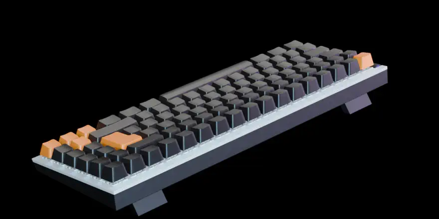

<b><a href=".github/assets/keyboard.stl">Open the mesh in GitHub's 3D viewer</a></b> — rotate, pan and zoom the real geometry.

About this object

A derivative of <i>NZXT miniTKL — mechanical Keyboard</i> by
<a href="https://sketchfab.com/blackcube4">BlackCube</a>, used under
<a href="https://creativecommons.org/licenses/by/4.0/">CC BY 4.0</a> and
modified; the original author and NZXT do not endorse it.

The image is a single Blender frame at 256 samples, held at the point in
the model's own <code>Open</code> action where the keycaps have lifted clear of
the switches. The linked <code>.stl</code> is the same model with the internals
removed and decimated to 4,200 triangles, which GitHub opens in its native 3D
viewer. It could not be embedded in this page: GitHub refuses to render an STL
block that large, and the sizes it does accept destroy the keycaps. Untextured,
because STL carries no materials. Pipeline in
<a href="scripts/render-keyboard.py"><code>render-keyboard.py</code></a>,
<a href="scripts/export-stl.py"><code>export-stl.py</code></a> and
<a href="scripts/compact-stl.mjs"><code>compact-stl.mjs</code></a>.

---

## Work

Every public repository, refreshed daily.

<!-- gallery:start -->
<table width="100%">
<tr>
<td width="25%" valign="top"><a href="https://github.com/ikerperez12/NexoIP-3D-Viewer">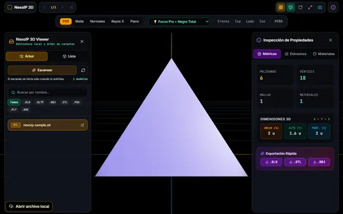</a> <b><a href="https://github.com/ikerperez12/NexoIP-3D-Viewer">NexoIP 3D Viewer</a></b> Offline-first desktop 3D viewer. Sandboxed renderer, private protocol, SBOM and checksums. <code>JavaScript</code> <code>MIT</code></td>
<td width="25%" valign="top"><a href="https://github.com/ikerperez12/IP-OS-LINUX">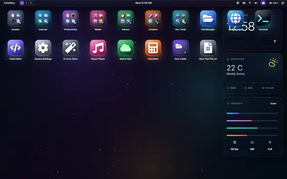</a> <b><a href="https://github.com/ikerperez12/IP-OS-LINUX">IP Linux</a></b> A desktop that runs in a tab: window manager, workspaces, IndexedDB filesystem. <code>12★</code> <code>TypeScript</code> <code>MIT</code> · <a href="https://ip-os-linux.vercel.app">live</a></td>
<td width="25%" valign="top"><a href="https://github.com/ikerperez12/UI-IP-Toolkit-v4.0">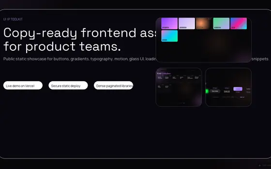</a> <b><a href="https://github.com/ikerperez12/UI-IP-Toolkit-v4.0">UI IP Toolkit</a></b> Copy-ready interface parts. axe-core gates serious regressions in CI. <code>9★</code> <code>HTML</code> <code>MIT</code> · <a href="https://ui-ip-toolkit.vercel.app/">live</a></td>
<td width="25%" valign="top"><a href="https://github.com/ikerperez12/e36">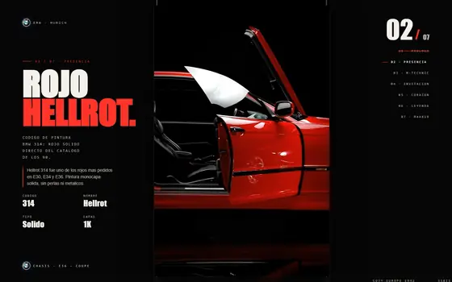</a> <b><a href="https://github.com/ikerperez12/e36">E36 Scroll Cine</a></b> Seven locked-scroll scenes, no framework. PWA with rendered accessibility tests. <code>4★</code> <code>HTML</code> <code>MIT</code> · <a href="https://e36.vercel.app">live</a></td>
</tr>
<tr>
<td width="25%" valign="top"><a href="https://github.com/ikerperez12/warpod">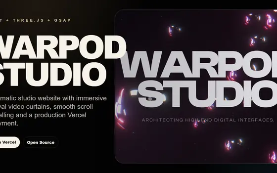</a> <b><a href="https://github.com/ikerperez12/warpod">Warpod Studio</a></b> Cinematic WebGL: React Three Fiber scene, GSAP choreography, smooth scroll. <code>4★</code> <code>JavaScript</code> <code>MIT</code> · <a href="https://warpod.vercel.app">live</a></td>
<td width="25%" valign="top"><a href="https://github.com/ikerperez12/EASY-LOCALHOST">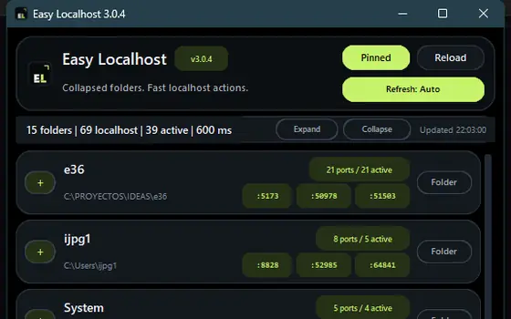</a> <b><a href="https://github.com/ikerperez12/EASY-LOCALHOST">Easy Localhost</a></b> Always-on-top panel for local dev servers. Ten releases, each with a SHA-256. <code>4★</code> <code>Python</code> <code>v3.0.4</code> <code>MIT</code></td>
<td width="25%" valign="top"><a href="https://github.com/ikerperez12/BLENDER-TOOL">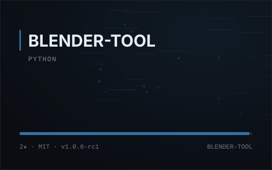</a> <b><a href="https://github.com/ikerperez12/BLENDER-TOOL">IP Blender Tool</a></b> Render queue for Blender. Scans .blend files for missing textures before queueing. <code>2★</code> <code>Python</code> <code>v1.0.0-rc1</code> <code>MIT</code></td>
<td width="25%" valign="top"><a href="https://github.com/ikerperez12/1.2-AuditoriaPQC">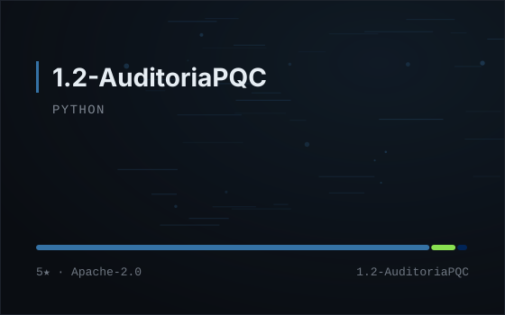</a> <b><a href="https://github.com/ikerperez12/1.2-AuditoriaPQC">QuantumGuard PQC lab</a></b> Post-quantum crypto lab driving real Open Quantum Safe containers. <code>5★</code> <code>Python</code> <code>Apache-2.0</code></td>
</tr>
<tr>
<td width="25%" valign="top"><a href="https://github.com/ikerperez12/WARP">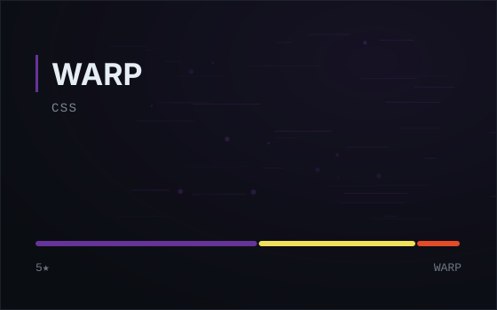</a> <b><a href="https://github.com/ikerperez12/WARP">WARP</a></b> Personal web portfolio. <code>5★</code> <code>CSS</code></td>
<td width="25%" valign="top"><a href="https://github.com/ikerperez12/Software-Design">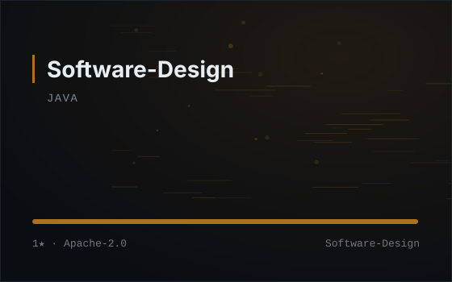</a> <b><a href="https://github.com/ikerperez12/Software-Design">Software-Design</a></b> Software design coursework: patterns and modular object-oriented design. <code>1★</code> <code>Java</code> <code>Apache-2.0</code></td>
<td width="25%" valign="top"><a href="https://github.com/ikerperez12/SIGNAL-NEURALNETWORK">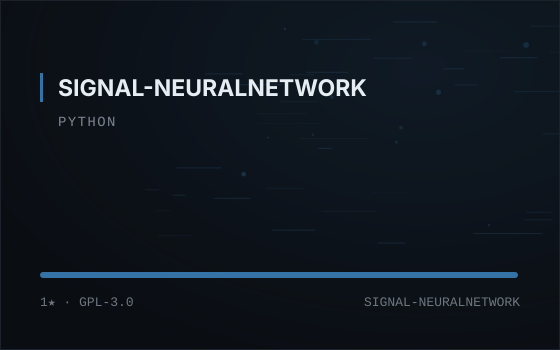</a> <b><a href="https://github.com/ikerperez12/SIGNAL-NEURALNETWORK">SIGNAL-NEURALNETWORK</a></b> Signal-processing neural network experiment. <code>1★</code> <code>Python</code> <code>GPL-3.0</code></td>
<td width="25%" valign="top"><a href="https://github.com/ikerperez12/GPT_CMD">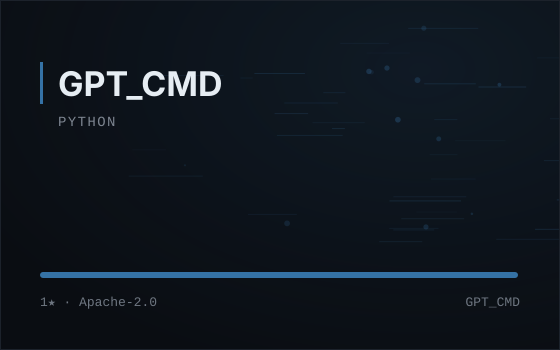</a> <b><a href="https://github.com/ikerperez12/GPT_CMD">GPT_CMD</a></b> Command-line ChatGPT automation with history, export and clipboard image send. <code>1★</code> <code>Python</code> <code>Apache-2.0</code></td>
</tr>
<tr>
<td width="25%" valign="top"><a href="https://github.com/ikerperez12/SO-SHELL-p2">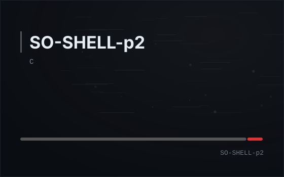</a> <b><a href="https://github.com/ikerperez12/SO-SHELL-p2">SO-SHELL-p2</a></b> UNIX shell in C: process lifecycle, file descriptors, redirection. <code>C</code></td>
<td width="25%" valign="top"><a href="https://github.com/ikerperez12/Basketball-API">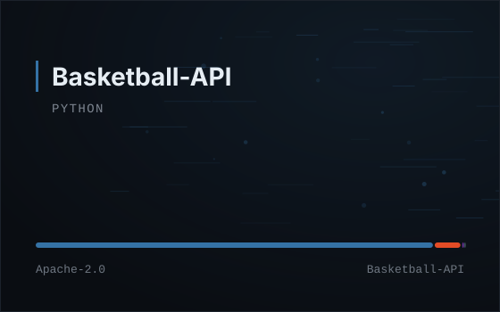</a> <b><a href="https://github.com/ikerperez12/Basketball-API">Basketball-API</a></b> Django REST API with a frontend, containerised. <code>Python</code> <code>Apache-2.0</code></td>
<td width="25%" valign="top"><a href="https://github.com/ikerperez12/SO-2324">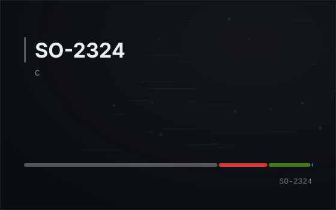</a> <b><a href="https://github.com/ikerperez12/SO-2324">SO-2324</a></b> Operating systems coursework in C at the Universidade da Coruña. <code>C</code></td>
</tr>
</table>
<!-- gallery:end -->

---

## Snake

Everyone shares one board, and it takes <b>two clicks</b>: a direction below
opens GitHub's new-issue form with the move already filled in, and then you press
the green <b>Create</b> button. That second click is the move. A workflow reads
it, advances the snake one cell, redraws this image and closes the issue —
usually within a minute. There is no one-click version: GitHub has no way to
create an issue straight from a link.

The edges wrap, so only running into the tail ends a run. State lives in
<a href=".github/state/snake.json"><code>.github/state/snake.json</code></a> and
every move is a commit — the history is the replay.

  <picture>
    <source media="(prefers-color-scheme: dark)" srcset=".github/assets/snake-dark.svg">
    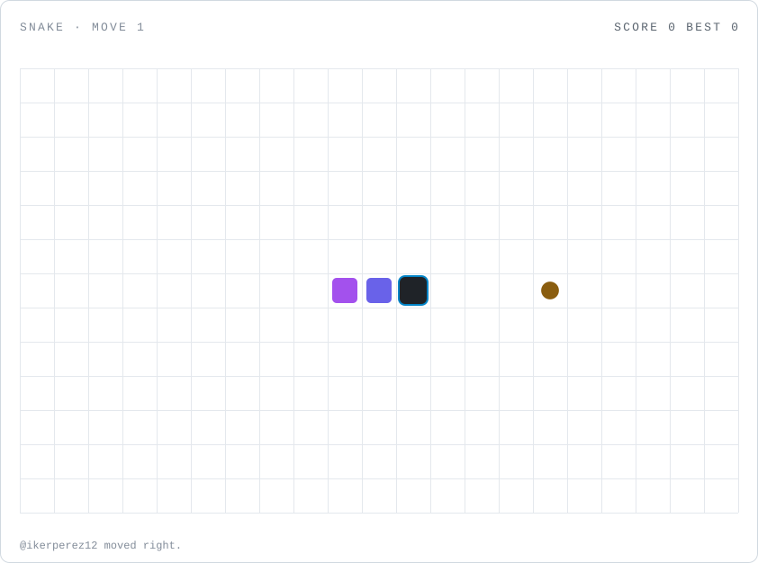
  </picture>

  <a href="https://github.com/ikerperez12/ikerperez12/issues/new?title=snake%7Cstart&body=Opens+GitHub%27s+new-issue+form+with+the+move+already+filled+in.+Press+the+green+Create+button+below+-+that+is+the+move.+You+can+leave+this+text+as+it+is."><b>▶&nbsp;start&nbsp;a&nbsp;new&nbsp;game</b></a>

  <a href="https://github.com/ikerperez12/ikerperez12/issues/new?title=snake%7Cup&body=Opens+GitHub%27s+new-issue+form+with+the+move+already+filled+in.+Press+the+green+Create+button+below+-+that+is+the+move.+You+can+leave+this+text+as+it+is."><b>&nbsp;↑&nbsp;up&nbsp;</b></a> &nbsp;·&nbsp;
  <a href="https://github.com/ikerperez12/ikerperez12/issues/new?title=snake%7Cleft&body=Opens+GitHub%27s+new-issue+form+with+the+move+already+filled+in.+Press+the+green+Create+button+below+-+that+is+the+move.+You+can+leave+this+text+as+it+is."><b>&nbsp;←&nbsp;left&nbsp;</b></a> &nbsp;·&nbsp;
  <a href="https://github.com/ikerperez12/ikerperez12/issues/new?title=snake%7Cdown&body=Opens+GitHub%27s+new-issue+form+with+the+move+already+filled+in.+Press+the+green+Create+button+below+-+that+is+the+move.+You+can+leave+this+text+as+it+is."><b>&nbsp;↓&nbsp;down&nbsp;</b></a> &nbsp;·&nbsp;
  <a href="https://github.com/ikerperez12/ikerperez12/issues/new?title=snake%7Cright&body=Opens+GitHub%27s+new-issue+form+with+the+move+already+filled+in.+Press+the+green+Create+button+below+-+that+is+the+move.+You+can+leave+this+text+as+it+is."><b>&nbsp;→&nbsp;right&nbsp;</b></a>

<!-- snake:start -->
**Move 0** · score **0** · best **0**

Waiting for the first move.

Recent players: nobody yet
<!-- snake:end -->

---

## Closing piece

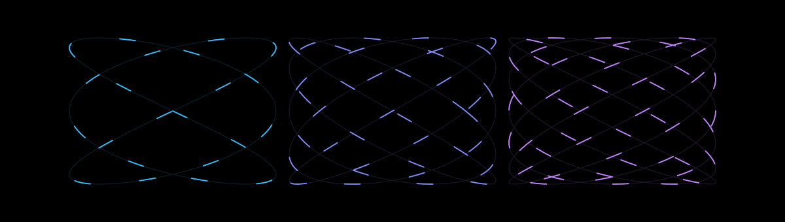

---

## Colophon

This page is the output of a small program.
[`scripts/collect.mjs`](scripts/collect.mjs) queries the GitHub API each
morning, [`scripts/build.mjs`](scripts/build.mjs) renders the SVGs from the
result, and [`.github/workflows/audit.yml`](.github/workflows/audit.yml) commits
whatever changed. The generated regions are bounded by HTML comments; everything
else here was written by hand.

The banner's numbers are counted, not claimed: the workflow reads every
repository and records only the engineering controls it can confirm — a CI
workflow, a published `SECURITY.md`, CodeQL, accessibility tests in CI,
dependency audits, release checksums, a software bill of materials. Gaps stay
gaps.

No third-party image services are used, so nothing here can break when someone
else's endpoint goes down, and no request leaves GitHub when you read this.
Motion is CSS inside the SVGs and stops for `prefers-reduced-motion`.

Deployments, last checked this morning

<!-- probes:start -->
- `answered 200` — [ip-os-linux.vercel.app](https://ip-os-linux.vercel.app)
- `answered 200` — [ui-ip-toolkit.vercel.app](https://ui-ip-toolkit.vercel.app/)
- `answered 200` — [e36.vercel.app](https://e36.vercel.app)
- `answered 200` — [warpod.vercel.app](https://warpod.vercel.app)
<!-- probes:end -->

Reported as reachability only. A deployment that does not answer is recorded as
such rather than quietly dropped.

<!-- stamp:start -->
Last audit: **2026-08-15 00:42 UTC**. Everything above is read from the GitHub API by [`scripts/collect.mjs`](scripts/collect.mjs) — nothing is typed in by hand.
<!-- stamp:end -->

A Coruña, Galicia · [ikerperez12](https://github.com/ikerperez12)
