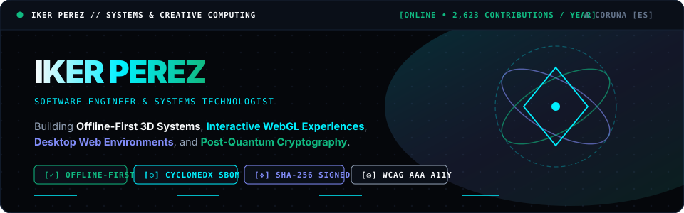
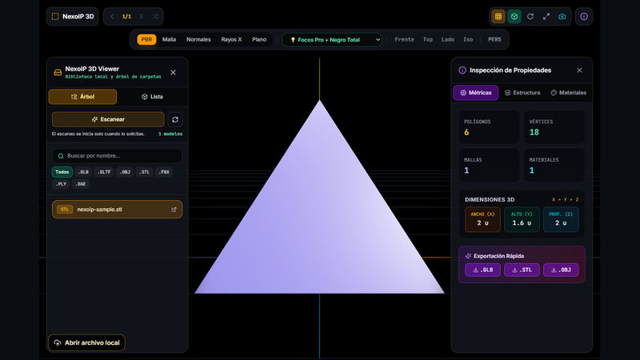
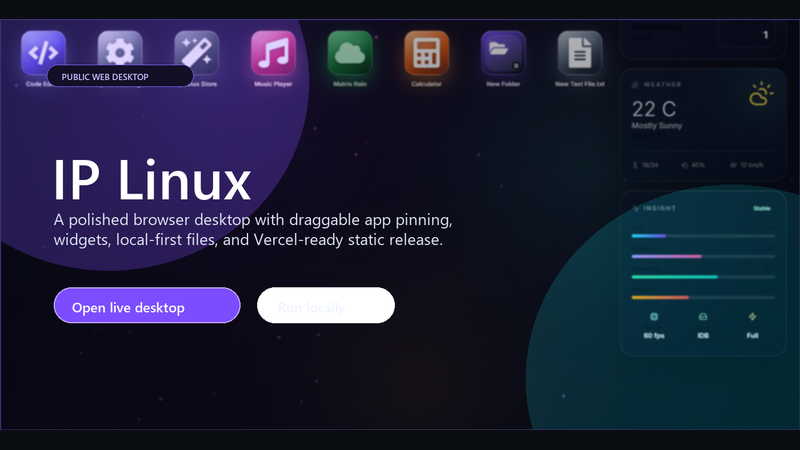
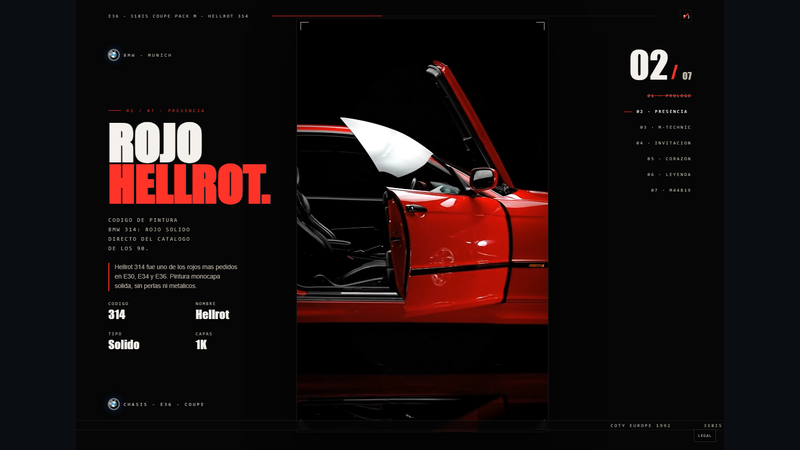
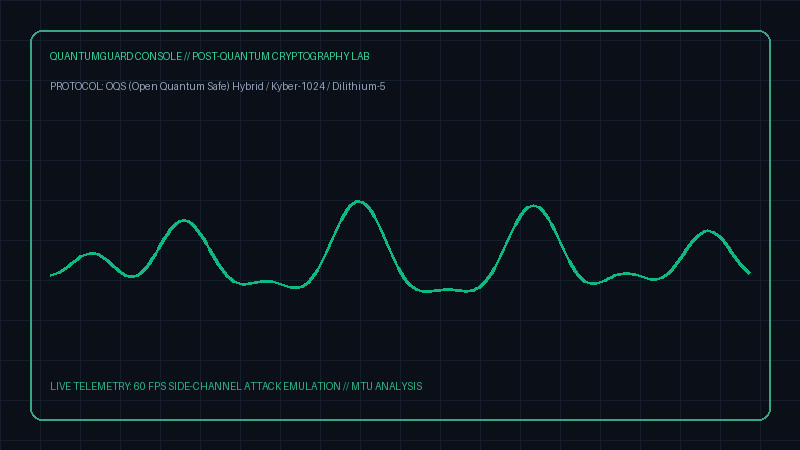

<!--
  =============================================================================
  IKER PÉREZ GARCÍA // SOFTWARE, SISTEMAS Y EXPERIENCIAS INTERACTIVAS
  Portfolio: https://nexoip.click
  =============================================================================
-->

  <picture>
    <source media="(prefers-color-scheme: dark)" srcset="assets/hero-dark.svg">
    <source media="(prefers-color-scheme: light)" srcset="assets/hero-light.svg">
    
  </picture>

---

# [ 02 // PROYECTOS PÚBLICOS Y DECISIONES DE INGENIERÍA ]

### [ SISTEMAS PRINCIPALES // FLAGSHIP SYSTEMS ]

<table>
  <tr>
    <td width="50%" valign="top">
      
       
      <b>NexoIP 3D Viewer</b> <code>v1.0.0</code>
       
      Visor 3D offline-first para Windows (Electron + Three.js + WebGL). Protocolo aislado <code>nexoip://</code>, SBOM CycloneDX v1.5 y validación de binarios SHA-256.
        
      
      
    </td>
    <td width="50%" valign="top">
      
       
      <b>IP-OS-LINUX</b> <code>10 Stars</code>
       
      Entorno de escritorio web tipo Linux (React 19 + TypeScript + Vite). Sistema de archivos virtual con IndexedDB, window manager, DOMPurify y accesibilidad WCAG AAA.
        
      
      
    </td>
  </tr>
  <tr>
    <td width="50%" valign="top">
      
       
      <b>e36 — Cinematic WebGL</b> <code>4 Stars</code>
       
      Experiencia interactiva 3D del BMW 318is Coupe Pack M. Transiciones Three.js a 60 FPS, motor táctil 9:16 mobile-first, diseño de audio DSP y vanilla JS.
        
      
      
    </td>
    <td width="50%" valign="top">
      
       
      <b>1.2-AuditoriaPQC — QuantumGuard</b> <code>3 Stars</code>
       
      Laboratorio de auditoría de Criptografía Post-Cuántica (PQC). Integración Open Quantum Safe (OQS), algoritmos Kyber-1024 / Dilithium-5 y análisis side-channel a 60 FPS.
        
      
      
    </td>
  </tr>
</table>

 

### [ CATÁLOGO COMPLETO DE REPOSITORIOS PÚBLICOS ]

| Dominio | Repositorio | Stack / Tecnologías | Descripción Técnica |
| :--- | :--- | :--- | :--- |
| **Sistemas &amp; Seguridad** | [`SO-SHELL-p2`](https://github.com/ikerperez12/SO-SHELL-p2) | `C` • `POSIX Syscalls` • `UNIX` | Shell UNIX de bajo nivel: gestión de procesos (`fork`/`exec`), descriptores de archivo, redirecciones y memoria. |
| **Sistemas &amp; Seguridad** | [`EASY-LOCALHOST`](https://github.com/ikerperez12/EASY-LOCALHOST) | `Python` • `PyInstaller` • `Tkinter` | Servidor HTTP local portable con GUI para desarrollo rápido (10 releases firmadas standalone). |
| **3D &amp; Creative** | [`BLENDER-TOOL`](https://github.com/ikerperez12/BLENDER-TOOL) | `Python` • `PySide6` • `Blender API` | Herramientas de automatización para pipelines 3D, validación de mallas y exportación optimizada. |
| **3D &amp; Creative** | [`warpod`](https://github.com/ikerperez12/warpod) / [`WARP`](https://github.com/ikerperez12/WARP) | `R3F` • `Three.js` • `GSAP` • `WebGL` | Experiencias interactivas 3D y portfolios inmersivos con shaders personalizados y animaciones físicas. |
| **UI &amp; Audio DSP** | [`UI-IP-Toolkit-v4.0`](https://github.com/ikerperez12/UI-IP-Toolkit-v4.0) | `CSS Architecture` • `HTML5` • `A11y` | Sistema de diseño modular y componentes accesibles con más de 140 variables CSS y soporte WCAG AAA. |
| **UI &amp; Audio DSP** | [`AURASYNTH`](https://github.com/ikerperez12/AURASYNTH) | `TypeScript` • `Web Audio API` • `DSP` | Sintetizador de audio web con osciladores de modulación en tiempo real y visualización espectral. |
| **AI &amp; Procesado de Señal**| [`SIGNAL-NEURALNETWORK`](https://github.com/ikerperez12/SIGNAL-NEURALNETWORK) | `Python` • `NumPy` • `DSP` • `PyTorch` | Procesado digital de señal (DSP), análisis espectral y modelos recurrentes para señales temporales. |
| **Arquitectura de Software** | [`Software-Design`](https://github.com/ikerperez12/Software-Design) | `Java` • `Design Patterns` • `SOLID` | Implementación de patrones de arquitectura enterprise, principios SOLID y clean architecture. |
| **Herramientas &amp; CLI** | [`GPT_CMD`](https://github.com/ikerperez12/GPT_CMD) | `Python` • `CLI` • `Automation` | Asistente de terminal e integración de pipelines de automatización para flujos de trabajo de ingeniería. |
| **Backend &amp; APIs** | [`Basketball-API`](https://github.com/ikerperez12/Basketball-API) | `Python` • `Django REST` • `Docker` | API REST para analítica y gestión deportiva con autenticación JWT y contenedorización Docker. |

---

  <b>IKER PÉREZ GARCÍA</b> • A Coruña, Galicia, Spain 
  Portfolio Web: <a href="https://nexoip.click"><b>nexoip.click</b></a> • <i>Living Engineering Profile</i>

